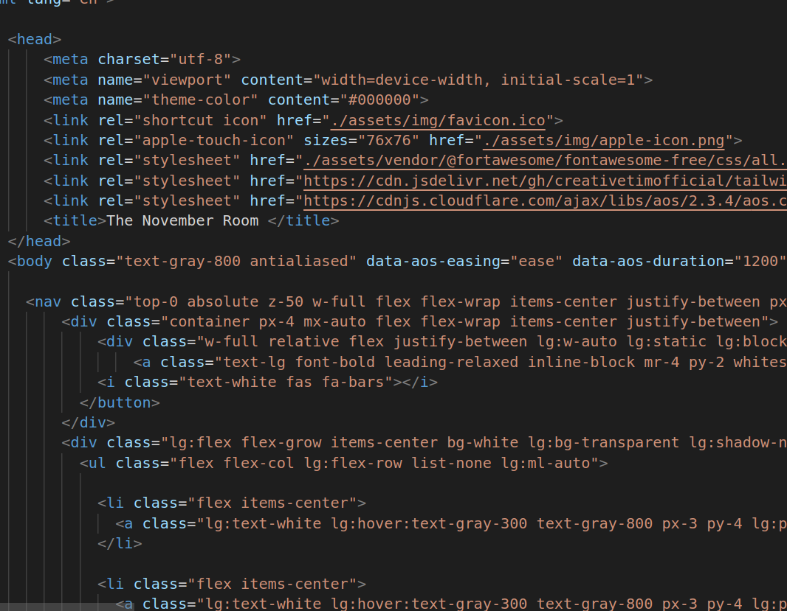
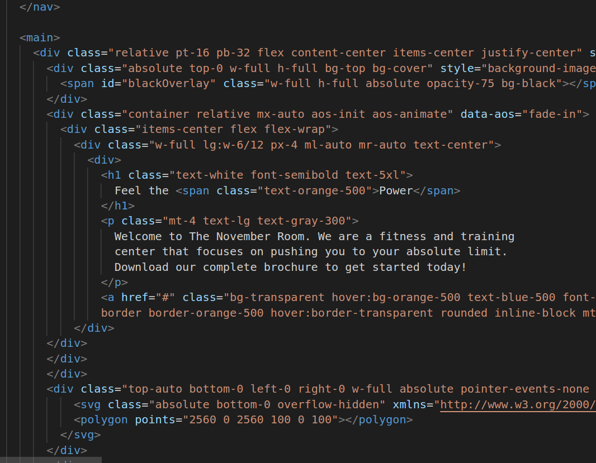
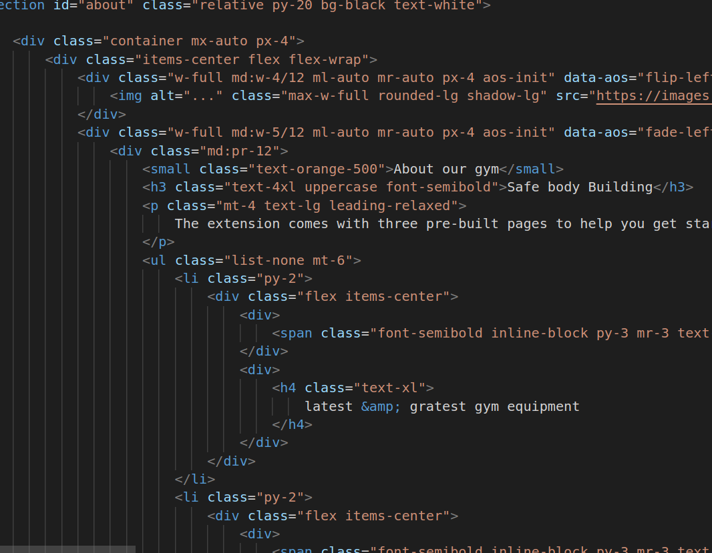
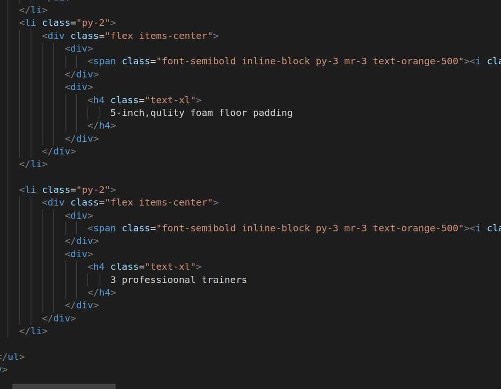
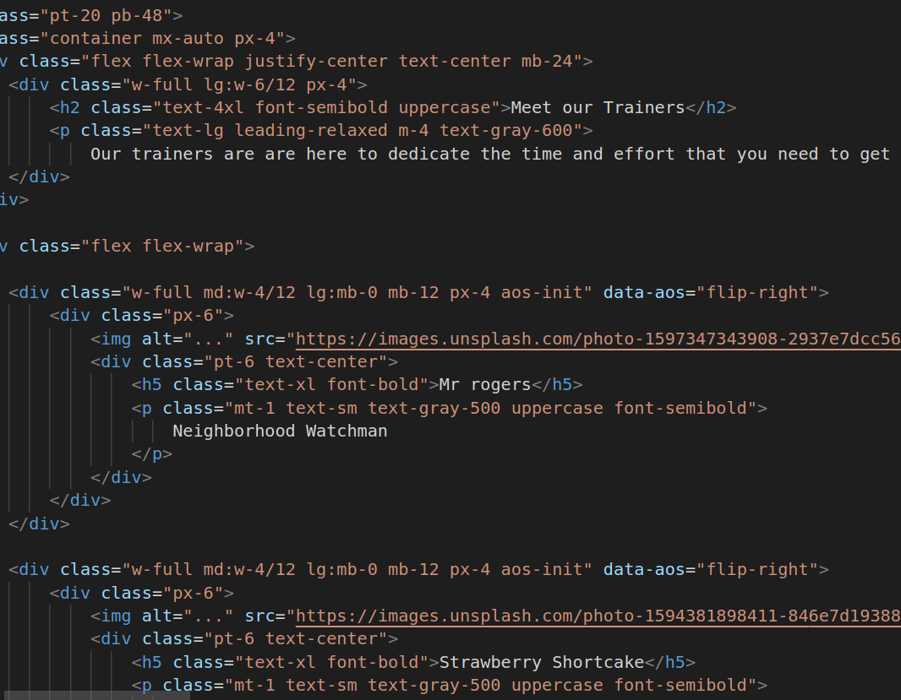
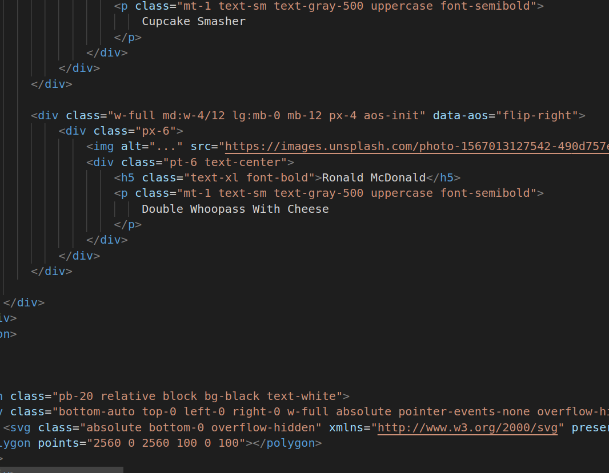
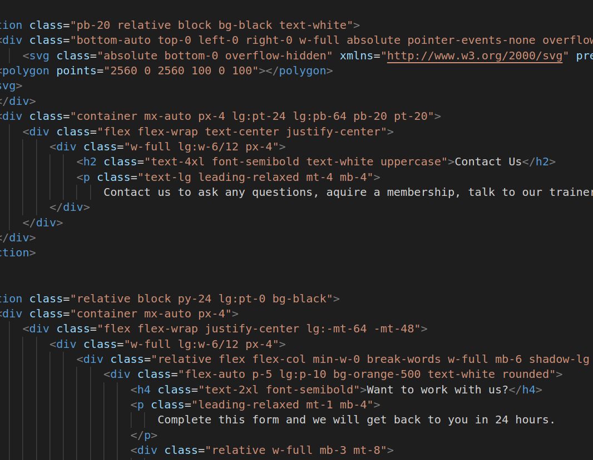
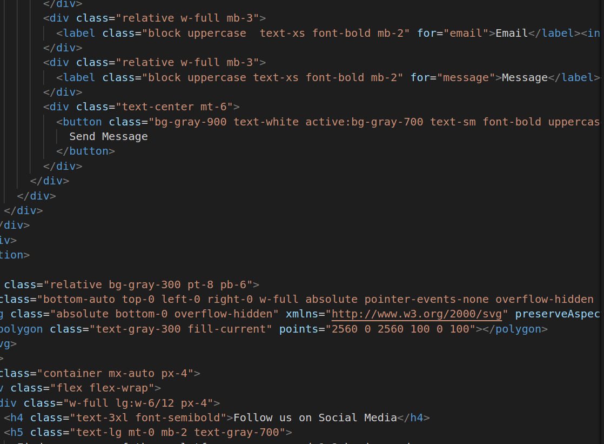
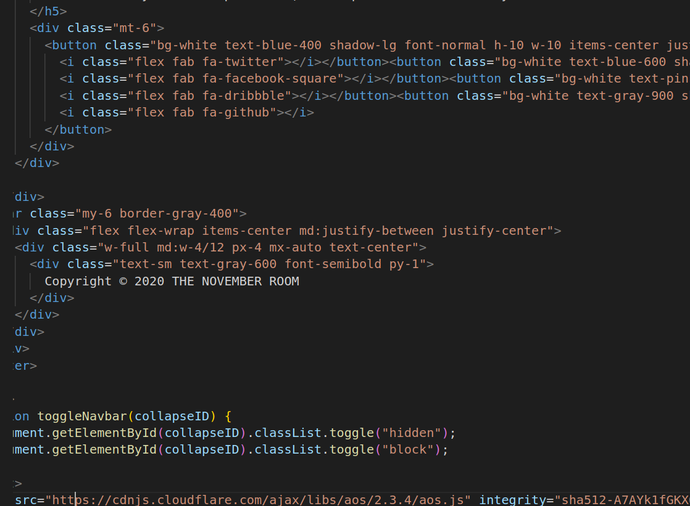
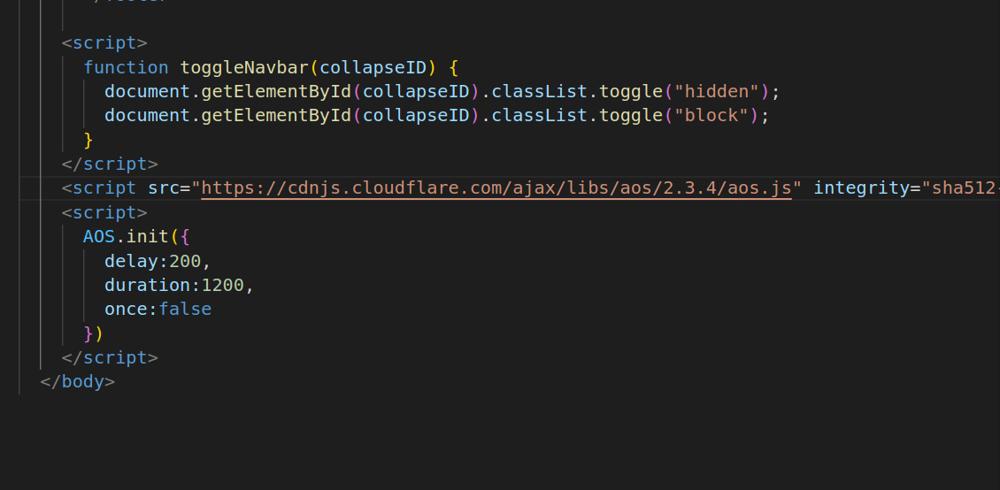

# Major Project using Tailwind

1.

2.

3.

4.

5.

* meta charset="utf-8": Specifies the character encoding for the document as UTF-8, which supports a wide range of characters.
* meta name="viewport" content="width=device-width, initial-scale=1": Sets the viewport configuration for responsive design.
* meta name="theme-color" content="#000000": Defines the theme color for the browser toolbar when the website is added to the home screen on a mobile device.
* link Tags:: Specifies the favicon (shortcut icon) for the website.
* link rel: Links to a CSS file for FontAwesome icons.
*  Links to an external CSS file for the AOS (Animate On Scroll) library.
title Element:
* title The November Room title: Sets the title of the webpage displayed in the browser's title bar or tab.
* body Element:
class="text-gray-800 antialiased": Sets the class attributes for the body element, which affect text color and antialiasing.
* data-aos-easing="ease" data-aos-duration="1200" data-aos-delay="200": Data attributes for configuring the AOS library animations on the body element.
* nav Element:
Defines a navigation bar at the top of the page with various classes for styling.
Contains a logo and a button to toggle the navigation menu on small screens.
* main Element:
Contains the main content of the webpage.
Sections:The code includes several section  elements with different IDs (about, and others) that represent different sections of the webpage, each with its own content and styling.
* footer Element:
Contains information about social media links and copyright.
Includes icons for social media platforms.
* script Tags:
The first script defines a JavaScript function toggleNavbar() used to toggle the navigation menu.
The second script includes the AOS library and initializes it with specific animation settings.

6.

7.

8.

9.

10.

* Text Color:
class="text-gray-800": This sets the text color to gray-800, which is a shade of gray. Tailwind CSS provides a range of text color classes, and you can specify the desired color by using a class like text-{color}.
Font Antialiasing:
* class="antialiased": This class enables font antialiasing, which smooths out the edges of text, making it appear cleaner and more legible. It's commonly used for better text rendering.
* Background Color:
class="bg-black": Sets the background color to black. Tailwind CSS allows you to specify background colors using classes like bg-{color}.
Padding and Margin:
* class="px-4 mx-auto": Sets horizontal padding (px-4) and horizontal margin (mx-auto). The px-{value} classes control padding, while mx-auto horizontally centers an element.
* Width and Height:
class="w-full h-full": Sets the width and height of an element to 100% of its parent container. w-full means full width, and h-full means full height.
* Border:class="border border-solid border-transparent": Configures a border for an element. In this case, it sets a transparent border. You can customize the border color, style, and width using Tailwind CSS classes.
* Rounded Corners:class="rounded-lg": Applies rounded corners to an element, making it have a more rounded shape. You can adjust the roundness with classes like rounded-{value}.
Font Size and Weight:

class="text-lg font-semibold": Sets the font size to "lg" and font weight to "semibold." Tailwind CSS provides classes for various font sizes and weights.
* Text Alignment:class="text-center": Centers text within its container. You can also use classes like text-left or text-right for different text alignments.
* Line Height:class="leading-relaxed": Sets the line height to a relaxed value. This can improve readability. Tailwind CSS provides different line height options.
* Flexbox:class="flex flex-wrap items-center justify-between": Configures a flex container with wrapping (flex-wrap), aligns items to the center vertically (items-center), and justifies content evenly between flex items (justify-between). Tailwind CSS simplifies flexbox layout.
* Visibility:class="hidden" and class="block": These classes toggle the visibility of an element. hidden hides an element, while block makes it visible. They are often used for responsive design.

